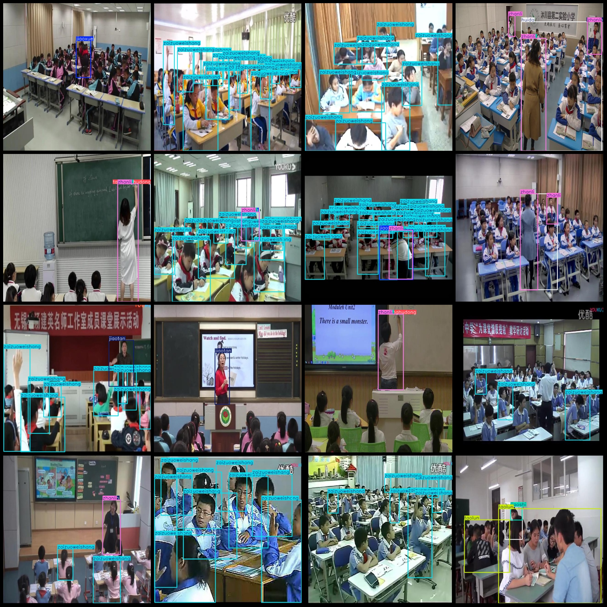
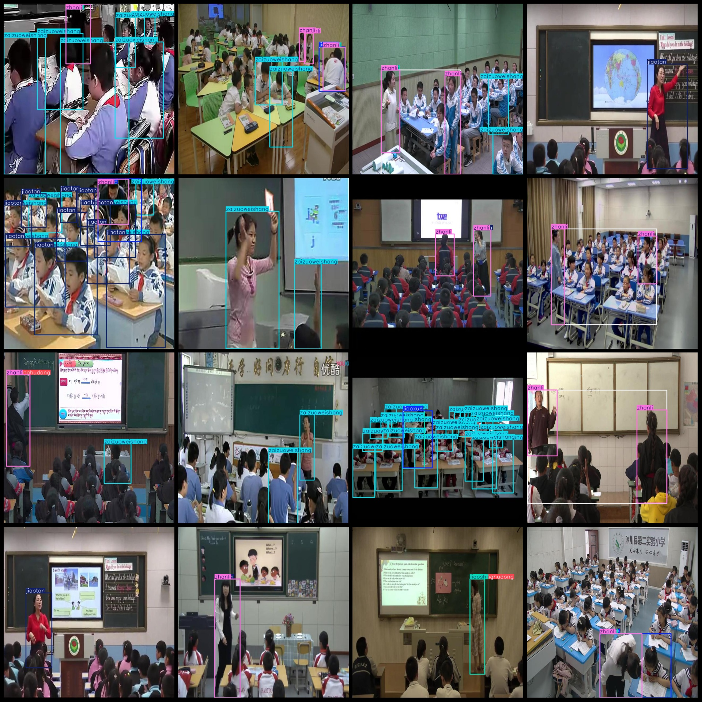

# Smart Classroom Student Behavior Detection Dataset VOC+YOLO Format with 12,406 Images of 8 Categories

Dataset format: Pascal VOC format + YOLO format (without split directory, only txt files containing jpg images and corresponding VOC format xml files and yolo format txt files)
number of images: 12406  
annotation count: 12406  
annotation count: 12406  
annotationnumber of classes: 8  
annotation class names: ["huida", "jiaoshi", "jiaotan", "jiaoxue", "taishanghudong", "taolun", "zaizuoweishang", "zhanli"]
[Answer, Teacher, Chat, Teaching, On stage interaction, Discussion, In the seat, Standing]
boxes per class:   
huida box count = 2870  
jiaoshi box count = 6264  
jiaotan box count = 5386  
jiaoxue box count = 1334  
taishanghudong box count = 1459  
taolun box count = 2251  
zaizuoweishang box count = 43927  
zhanli box count = 11374  
total boxes: 74865  
images per class:   
huida images = 2869  
jiaoshi images = 6240  
jiaotan images = 4504  
jiaoxue images = 1334  
taishanghudong images = 1431  
taolun images = 392  
zaizuoweishang images = 6718  
zhanli images = 6890  
image resolution: 640x640  
Using the annotation tool: labelImg,
Annotation rules: draw a rectangle around the class.
Important notes: The dataset does not include a training/validation/test set; you need to manually split it.
Special statement: This dataset does not guarantee the accuracy of the trained model or weight file.
Image preview:
## Images

Here is a pay link on Stripe ( https://buy.stripe.com/3cs8yP7sY87d0vu9AB ). Please contact me lonlonago@foxmail.com after funding $89, and I will send you a complete data files , thank you!

